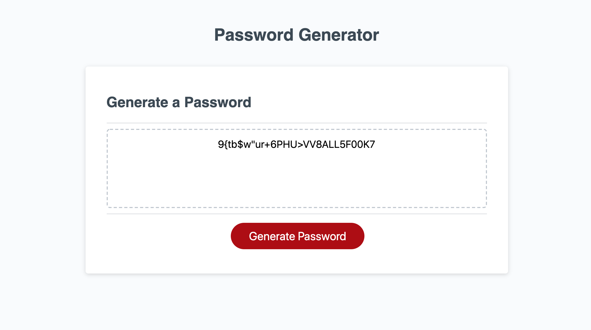

# Password Generator

A password generator that creates a password depending on user input. The generator takes into account whether the user wants to include uppercase/lowercase letters, numbers or special characters, and generates a password based on those criteria. The limit is 128 characters.

# Description of Design

The program uses JavaScript and takes advantage of for/while loops, along with many conditional statements and Object manipulation, especially in determining how many characters are left and how many of each character will be used.

Access the password generator here: https://vxmao87.github.io/password-generator/
